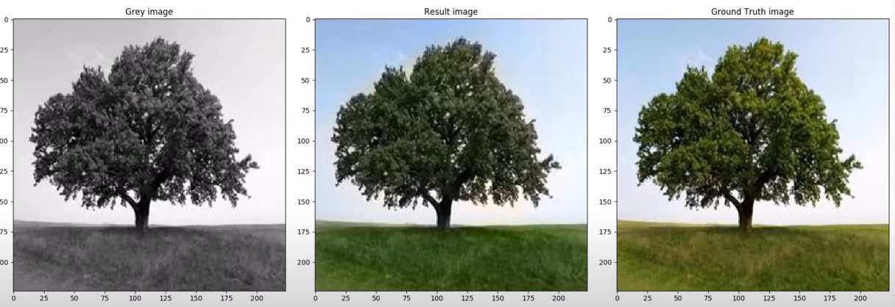
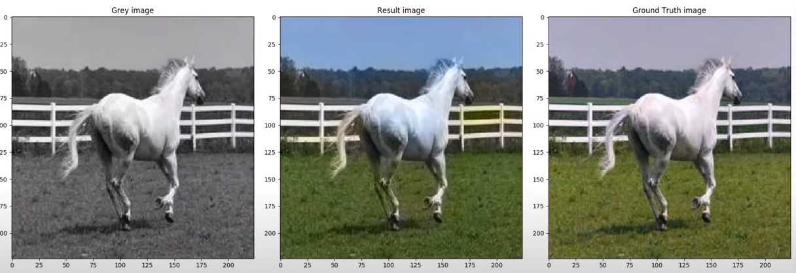

# watch the demo on youtube:
https://www.youtube.com/watch?v=Jgc8eNd_4Eg&t=57s

# Deep-learning-Colorization-for-visual-media
Automatic colorization for grayscale (images/ videos) based on Deep-Learning using (Python &amp; Tensorflow).
* A TensorFlow version of (Let there be Color!: Joint End-to-end Learning of Global and Local Image Priors for Automatic Image Colorization with Simultaneous Classification) http://hi.cs.waseda.ac.jp/~iizuka/projects/colorization/en/
Applied on Landscape images only(2000 images from MIT Places) data-set for leak of resources.

# TODO :
* implement videos part
* apply and re-train the model using classification network
* train the model on more than one category.
* find all information needed in project documentation and presentation files from google drive link below.  https://drive.google.com/drive/folders/0B7FFqObqrfTDOG5OSVZ4UUJ5S1U?usp=sharing

# to test .exe version 
https://drive.google.com/drive/folders/0B7FFqObqrfTDTWJMcE5UN3I3UjQ?usp=sharing
* note: it's trained only on simple landscape images(2000 image) so it will not give a good result if tried to test anothe category or complex images
* download .exe file attached from google drive and instruction file
* read insteraction to use .exe.txt to know how to run for first time
* Colorization trained model weights https://drive.google.com/file/d/1QzTMl8jHeowjzRP7DcfIQk4IpwVyTaGo/view?usp=sharing
* let me know if you faced any problems with loading the pre-trained weights

# Notes
* project is still under maintenance and processing.
* you should be aware of change file pathes corrosponding to your data set locations when try to read or test images
* you should be aware of handling creating Model weight directory for first time to save trained model's weights every time you perform tarining.
* There is a single file containing the whole code as functions used temporarily for testing.

for any questions: omar.sayed.mostafa@gmail.com

